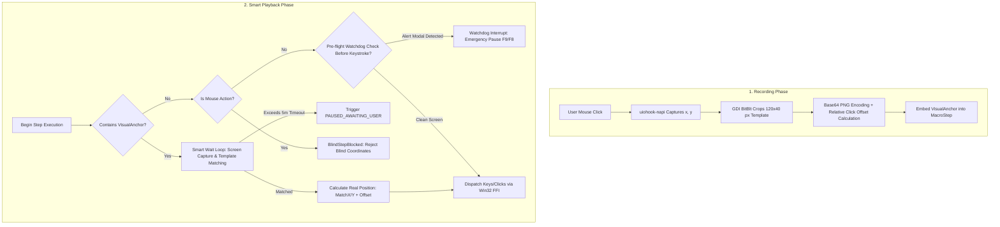
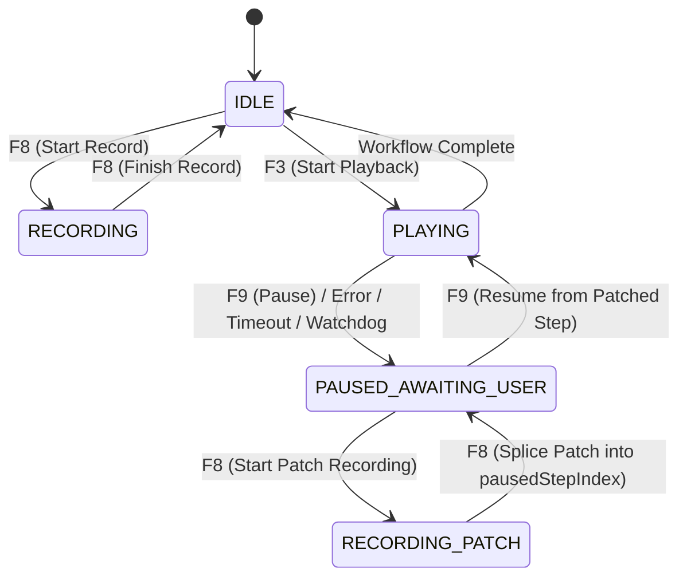

# COMPREHENSIVE PROJECT ANALYSIS REPORT: SMART MACRO STUDIO
*(Electron & React Enterprise Automation Engine)*

---

## 1. EXECUTIVE SUMMARY & PROBLEM STATEMENT

### 1.1 Project Overview
- **Project Name:** Smart Macro Studio (Package Name: `macro-auto`)
- **Current Version:** `0.0.5`
- **Persistence Schema:** `v1.1`
- **Core Objective:** Build a next-generation desktop Robotic Process Automation (RPA) tool for Windows, executing a full paradigm shift from legacy **Blind Coordinate Automation** to intelligent **Visual RPA** equipped with computer vision recognition, dynamic latency tolerance, data corruption prevention, and on-the-fly operator remediation (*On-the-fly Patching*).

---

### 1.2 The Context & Critical Flaws of Legacy Desktop Macros
Legacy automation tools (standard AutoHotkey scripts, basic AutoIt setups, coordinate-based clickers) rely on two fatal assumptions in enterprise environments:
1. **Coordinates `(x, y)` Are Static:** In real-world enterprise environments (web-based ERP/CRM portals, SAP GUI, Java Swing thick clients, Excel sheets), interfaces dynamically reflow. Dynamic banner heights, DPI scaling, font variations, and window resizing shift target elements by dozens of pixels. A blind coordinate click hits empty whitespace or triggers unintended destructive actions.
2. **System Latency Is Invariant:** Classical macros rely on hardcoded sleep periods (`delay = 500ms`). When enterprise servers experience peak load or network latency stretches a query from 2 seconds to 30 seconds, a fixed-delay macro continues blindly dispatching clicks and keystrokes into the void, causing downstream cascading failures.
3. **Unexpected Modals & Disruptive Alerts:** During bulk data entry, systems frequently throw unpredicted dialogs (*"Session Expired"*, *"Conflict Detected"*, *"Confirm Overwrite"*). Blindly firing keystrokes (such as Enter or Tab) over an unexpected modal can confirm dangerous irreversible operations or corrupt business databases.

---

### 1.3 The Visual RPA Pivot
Smart Macro Studio resolves these challenges through four foundational architectural pillars:
- **See:** Every click action records a localized visual anchor (`VisualAnchor` - Base64 PNG, $120 \times 40$ pixels) at the exact interaction point.
- **Wait:** The `Smart Wait` engine continuously inspects the active display via template matching, executing actions only when the element is visually confirmed (with configurable timeout up to 5 minutes).
- **Watch:** An interleaved `Multi-Watchdog Scanner` verifies screen state against registered anomaly dialogs before dispatching any keystrokes.
- **Heal:** Operator-in-the-loop `On-the-fly Patching` (`F8`) enables instant recording and insertion of corrective steps right at the failure point without restarting workflows from scratch.



---

## 2. DESIGN PHILOSOPHY & THE "PONYTAIL" DOCTRINE

The codebase strictly adheres to the **"Lazy Senior Developer"** philosophy documented in `.github/ponytail.md`:

1. **Strict "No OpenCV" Constraint (Zero Native Build Hell):**
   - Heavy C++ wrappers such as `opencv4nodejs` or `robotjs` are strictly forbidden. They introduce fragile `node-gyp` toolchains, C++ ABI mismatch crashes across Electron/V8 updates, and massive application bloat.
   - Instead, the engine utilizes **Koffi** (high-performance C-FFI) to invoke native Win32 GDI C-APIs built directly into the Windows kernel.
2. **Lightning-Fast Native Win32 Screen Capture:**
   - Powered by `GetDC(NULL)` + `CreateCompatibleDC` + `BitBlt` + `GetDIBits`.
   - Full virtual-screen capture finishes in **3ms – 8ms**, consuming less than 1% CPU with zero child-process overhead.
3. **Pure JS / TypedArray SAD Image Processing:**
   - Self-contained pure JavaScript PNG encoding/decoding (`zlib.deflateSync`/`inflateSync`) and template matching evaluated directly on raw `Uint8Array` grayscale buffers.
4. **Minimalistic Footprint (Boring over Clever):**
   - Entire workflows persisted within a single transparent JSON file. No premature abstractions, fewest files possible, and root-cause fixes across all layers.

---

## 3. SYSTEM ARCHITECTURE & PROCESS SEPARATION

The system is architected across Electron's secure two-tier process boundary integrated with React 19:

```
┌─────────────────────────────────────────────────────────────────────────────┐
│                             ELECTRON MAIN PROCESS                           │
│  - electron/main.cjs: App Lifecycle, Windows, Global Hotkeys (F8/F3/F9)     │
│  - electron/native-automation.cjs: Win32 GDI/User32 FFI via Koffi, uiohook  │
│  - Debug Overlay Window: Visual boundary flash (#ef4444 Red / #22c55e Green)│
│  - File System Access: Macro JSON Read/Write, Automatic PNG Diagnostic Dump │
└──────────────────────────────────────┬──────────────────────────────────────┘
                                       │ Secure IPC (Context Isolation = true)
                                       │ preload.cjs / window.macroAPI
┌──────────────────────────────────────▼──────────────────────────────────────┐
│                            RENDERER PROCESS (WEB UI)                        │
│  - React 19 + TypeScript + Vite 8 + Tailwind CSS v4                         │
│  - src/App.tsx: Execution Orchestrator, Smart Wait & Watchdog Loop          │
│  - src/engine/stateMachine.ts: Finite State Machine & On-the-fly Patching   │
│  - src/components/FloatingMiniMenu.tsx: 450px Dark Glassmorphism HUD        │
│  - src/components/PlaylistWindow.tsx: Standalone Multitasking Popup Window  │
└─────────────────────────────────────────────────────────────────────────────┘
```

### 3.1 IPC Channel Specification Table

| IPC Channel | Direction | Payload & Architectural Responsibility |
| :--- | :--- | :--- |
| `automation:perform-step` | Renderer $\rightarrow$ Main | Executes a single native step (`MacroStep`) via Win32 APIs. |
| `automation:find-anchor` | Renderer $\rightarrow$ Main | Searches for a `VisualAnchor` template across the active screen. |
| `automation:check-watchdogs` | Renderer $\rightarrow$ Main | Performs single-frame scan matching against registered `WatchdogRule[]`. |
| `dialog-save-as` | Renderer $\rightarrow$ Main | Opens native Save dialog for `.json` and dumps diagnostic PNG files. |
| `dialog-open` | Renderer $\rightarrow$ Main | Opens native Open dialog to select and load an existing macro JSON. |
| `quick-save` | Renderer $\rightarrow$ Main | Silently saves workflow to known file path (used during On-the-fly Patching). |
| `open-macro-at-path` | Renderer $\rightarrow$ Main | Loads a macro directly from path (used for playlist rehydration). |
| `macro-record-event` | Main $\rightarrow$ Renderer | Streams keyboard, mouse, wheel inputs and captured `anchor` data. |
| `hotkey-toggle-record` | Main $\rightarrow$ Renderer | Notifies global hotkey press: **`F8`** (Record / Patch toggle). |
| `hotkey-play-macro` | Main $\rightarrow$ Renderer | Notifies global hotkey press: **`F3`** (Play / Loop). |
| `hotkey-resume-macro` | Main $\rightarrow$ Renderer | Notifies global hotkey press: **`F9`** (Emergency Pause / Resume). |
| `hotkey-capture-watchdog` | Main $\rightarrow$ Renderer | Notifies global hotkey press: **`Shift + F8`** (Capture Watchdog modal). |

---

## 4. DETAILED FILE-BY-FILE CODEBASE AUDIT

### 4.1 Root Configuration & Build Layer

#### 1. `package.json`
- **Application Identification:** Package name `macro-auto`, product name `macro-auto`, version `0.0.5`, module type: `module`.
- **Core Dependencies:**
  - `koffi` (`^3.3.1`) & `@koromix/koffi-win32-x64` (`3.3.1`): High-speed C-FFI calling Windows DLLs directly with zero compilation overhead.
  - `uiohook-napi` (`^1.5.5`): OS-level global keyboard and mouse event interception.
  - `node-gyp-build` (`^4.8.4`): Prebuilt native binary loader.
- **Frontend Stack:** React 19.0.1, Electron 44.4.5, Vite 8.3.0, Tailwind CSS 4.3.3 (`@tailwindcss/vite`), TypeScript 7.0.2, Lucide React 0.546.0, Electron Builder 26.15.3.
- **Scripts:**
  - `npm run dev`: Launches `scripts/dev-desktop.cjs` (Vite dev server + live Electron runner).
  - `npm run build`: Compiles React assets into `dist/`.
  - `npm run desktop`: Launches Electron against built `dist/index.html`.
  - `npm run lint`: Runs `tsc --noEmit`.
  - `npm run prepackage`: Automatically increments the patch version (`npm version patch --no-git-tag-version`).
  - `npm run package`: Runs lint, build, and generates a professional Windows NSIS Setup installer.
- **Packaging Configuration (`build`):** `appId: com.ponytail.macro`, target `win: nsis`, interactive setup (`oneClick: false`, `allowToChangeInstallationDirectory: true`, `createDesktopShortcut: true`), unpacked native binaries via `asarUnpack`.

#### 2. `tsconfig.json`
- Targets modern JavaScript standards: Target `ES2022`, Module `ESNext`, `jsx: react-jsx`, ModuleResolution `bundler`.
- Configures path alias mapping `@/*` to project source.

#### 3. `vite.config.ts`
- Uses relative base path `./` to load bundled assets properly under Electron's `file://` protocol.
- Integrates `@tailwindcss/vite` and `@vitejs/plugin-react`.
- Supports `DISABLE_HMR` flag to reduce CPU cycles in low-spec environments.

#### 4. `index.html` & `metadata.json`
- Defines HTML shell, viewport settings, window titles, and mounting anchor `#root`.

---

### 4.2 Electron Process Layer

#### 1. `electron/preload.cjs` (Secure Context Bridge)
- Implements `contextBridge.exposeInMainWorld('macroAPI', {...})` conforming to strict security standards:
  - `contextIsolation: true`.
  - `nodeIntegration: false`.
- The renderer is completely isolated from Node.js `fs`, `child_process`, and Win32 handles, communicating solely through sanitized `macroAPI` methods.
- Event listener bindings return a teardown function (`removeListener`) preventing memory leaks during React component remounts.

#### 2. `electron/main.cjs` (Main Process & Lifecycle Controller)
- **Window Management:** Fixed dimensions $500 \times 320$, non-resizable (`resizable: false`), hidden menu bar, dark theme background `#0a0a0a`.
- **Debug Overlay System (`flashAnchor`):**
  - Generates a transparent, frameless, click-through overlay window (`frame: false, transparent: true, setIgnoreMouseEvents(true), alwaysOnTop: true`).
  - Flashes **Red (`#ef4444`)** around captured anchor boxes during recording.
  - Flashes **Green (`#22c55e`)** around matched elements when found during Smart Wait.
  - Automatically hides after 400ms.
- **Path Trust Boundary (`assertMacroPath`):** Validates that all renderer-supplied file paths are absolute and terminate with `.json`.
- **Diagnostic Image Dumper (`dumpAnchorImages`):** Automatically decodes and extracts each step's Base64 PNG template onto disk as `<Name>_Step_<N>.png` upon saving, providing visible transparency for QA.
- **Zero-Bypass DevTools Lockdown:** Intercepts `F12` and `Ctrl+Shift+I/C/J` across all `WebContents` instances, auto-closing DevTools if opened.
- **Global Input Interceptor (`startGlobalInputHook`):**
  - Initialized with `uiohook-napi`.
  - Captures `mousedown` events via `captureSnippet` and emits them to renderer.
  - Transmits `wheel` scroll events for renderer-side coalescing.
  - Tracks `mousemove` positions to enable instant watchdog template capture via **Shift+F8**.
- **Global Hotkey Registration:** Binds F8 (Record/Patch), F3 (Play), F9 (Pause/Resume), and Shift+F8 (Watchdog Capture).

#### 3. `electron/native-automation.cjs` (Native Win32 Engine)
The low-level automation core, containing graphics processing, screen capture, and hardware emulation:
1. **Win32 FFI via Koffi:**
   - Dynamically loads `user32.dll` and `gdi32.dll`.
   - Binds C functions: `SetCursorPos`, `mouse_event`, `keybd_event`, `SendInput`, `GetDC`, `ReleaseDC`, `CreateCompatibleDC`, `CreateCompatibleBitmap`, `SelectObject`, `BitBlt`, `DeleteObject`, `DeleteDC`, `GetSystemMetrics`, `GetCursorPos`, `GetDIBits`.
2. **Virtual Screen Geometry:**
   - Measures composite multi-monitor desktop bounds using `SM_XVIRTUALSCREEN`, `SM_YVIRTUALSCREEN`, `SM_CXVIRTUALSCREEN`, `SM_CYVIRTUALSCREEN`.
   - Correctly handles negative virtual-screen offsets when secondary displays sit to the left or above primary displays.
3. **Pure JS PNG Compression (`encodePng`):**
   - Implements pure JS 256-entry CRC32 table.
   - Formats BGRA to RGBA scanlines, compresses with `zlib.deflateSync`, and formats standard PNG chunks: `IHDR`, `IDAT`, `IEND`.
4. **Pure JS PNG Decompression & Grayscale Conversion (`decodePngToGray`):**
   - Decompresses `IDAT` chunks using `zlib.inflateSync`.
   - Supports all 5 standard PNG scanline filter types (Filter 0: None, Filter 1: Sub, Filter 2: Up, Filter 3: Average, Filter 4: Paeth).
   - Converts RGB to ITU broadcast standard grayscale:
     $$\text{Gray} = (R \times 77 + G \times 150 + B \times 29) \gg 8$$
5. **Ultra-Fast Grayscale Screen Capture (`captureScreenGrayscale`):**
   - Blits virtual-screen contents via GDI `BitBlt` into a 32-bit top-down DIB Section.
   - Converts pixels directly into a flat `Uint8Array` grayscale buffer in 3ms – 8ms.
6. **Two-Phase Template Matcher with Euclidean Disambiguation (`matchTemplateGrayscale`):**
   - **Phase 1 (Coarse Subsampled Scan):** Steps every 2 pixels ($x, y \mathrel{+}= 2$) over sample offsets. Computes Sum of Absolute Differences (SAD). Aborts candidate scans early if threshold exceeded.
   - **Candidate Selection & Euclidean Sorting:**
     $$\text{dist} = \text{Math.hypot}(\text{cand.x} - \text{origX}, \text{cand.y} - \text{origY})$$
     Sorts all matching candidates by spatial proximity to the original recorded interaction coordinates, preventing misclicks onto monochromatic screen edges.
   - **Phase 2 (Fine Neighborhood Search):** Evaluates a $\pm 2\text{px}$ local neighborhood with 1-pixel resolution around the best candidate to achieve sub-pixel accuracy.
7. **Single-Capture Multi-Watchdog Scanner (`checkWatchdogs`):**
   - Captures the screen once and sequentially tests all active watchdog modal rules, optionally constraining the evaluation window via `searchRegion`.
8. **Linear Cursor Glide (`moveCursorTo`):**
   - Interpolates mouse movement across up to 16 frames spaced 8ms apart. Fires realistic `:hover` and `mouseenter` events before clicks.
9. **Reliable Mouse Emulation:**
   - Button presses (`LEFTDOWN`, `RIGHTDOWN`) are wrapped in `try...finally` blocks to guarantee releases (`LEFTUP`, `RIGHTUP`), preventing stuck mouse buttons.
10. **Native Unicode & Vietnamese Typing (`typeText`):**
    - Constructs Win32 40-byte `INPUT` structures using `KEYEVENTF_UNICODE` (`0x0004`).
    - Dispatches UTF-16 code units directly to `wScan` via `SendInput`, providing flawless Vietnamese and emoji text generation.

---

### 4.3 State Machine & Engine Logic Layer

#### 1. `src/engine/stateMachine.ts` (Finite State Machine)
Maintains system lifecycle integrity across 5 finite states:
- `IDLE`: Ready to record or play.
- `RECORDING`: Intercepting inputs into a new macro (press F8 to stop).
- `PLAYING`: Executing macro workflow (F3 to restart, F9 to emergency pause).
- `RECORDING_PATCH`: Recording corrective steps after an execution anomaly.
- `PAUSED_AWAITING_USER`: Paused waiting for operator intervention (after timeout, error, or watchdog trigger).



#### 2. `src/types/macro.ts` & `src/types/electron.d.ts` (Data Models)
- **`VisualAnchor`:** Contains `templateBase64`, `width`, `height`, `origX`, `origY`, `relativeClickOffset`, `confidenceThreshold` (default: 0.85), `timeoutMs` (default: 300,000ms), and `pollIntervalMs` (default: 500ms).
- **`WatchdogRule`:** Anomaly dialog detection definition with confidence threshold and optional `searchRegion`.
- **`MacroStep`:** Single interaction step (`click`, `double_click`, `right_click`, `move`, `keypress`, `type_text`, `delay`, `scroll`). Stores `delayBefore`, `delayAfterMs`, `fallbackCoords`, `visualAnchor`, `keyData`, `wheelData`.
- **`MacroFile` (Schema v1.1):** Top-level persistence structure storing schema version, metadata, and step arrays.

---

### 4.4 User Interface Layer

#### 1. `src/App.tsx` (Execution Orchestrator)
- **Scroll Event Coalescing (`flushWheelStep`):** Buffers continuous wheel ticks within a 150ms window, collapsing bursts into a single unified `scroll` step to prevent JSON bloat.
- **Natural Cadence Calculation (`delayBefore`):** Measures real operator pauses between actions, capping at 10s to faithfully reproduce natural human rhythm.
- **Smart Wait Loop:**
  - Enforces blind coordinate rejection: mouse steps without a `visualAnchor` immediately throw `BlindStepBlocked`.
  - Steps containing a `visualAnchor` enter the non-blocking polling loop, rendering real-time countdown progress: *"Searching element... (00:14 / 05:00)"*.
  - Settle delay: pauses 500ms after visual match (*"Settling..."*) to allow UI layout animations to finish before clicking.
- **Pre-Flight Watchdog Guard:** Executes screen checks before any keyboard step (`keypress`, `type_text`), pausing immediately if a modal appears.
- **Audio Feedback (Web Audio API):** Reuses a singleton `AudioContext` (`beepContext`) to emit non-blocking audio cues on hotkey triggers.
- **Mini Input Modal (`promptForText`):** Lightweight DOM modal enabling operators to name watchdog rules captured via Shift+F8.
- **Loop Modes:** Supports `Once`, `∞` (Infinite), and fixed execution count bounds.

#### 2. `src/components/FloatingMiniMenu.tsx` (Glassmorphism HUD)
- Compact $450\text{px}$ floating bar styled in dark glassmorphism (`neutral-950/95` background, `neutral-800/80` borders).
- Live pulsing state badges: `RECORDING [F8]`, `PLAYING [F3]`, `WAITING [F3]`, `PATCHING [F8]`, `WATCHDOG HALT [F8/F9]`.
- Displays thumbnail previews of active `VisualAnchor` templates along with match thresholds.
- Houses controls: Hotkey shortcuts, file Save/Load triggers, and Playlist launcher.

#### 3. `src/components/PlaylistWindow.tsx` (Multitasking Playlist)
- Spawns an independent child window via `window.open` + `createPortal` ($520 \times 360\text{px}$).
- Synchronizes styles automatically from parent window to maintain full Tailwind styling.
- Persists and rehydrates macro queues through `localStorage` and `openMacroAt` IPC calls.

---

### 4.5 Development & Test Scripts Layer

1. **`scripts/dev-desktop.cjs`:**
   - Starts Vite Dev Server via dynamic ESM imports and spawns Electron alongside.
   - Employs native `fs.watch` on `electron/` to restart Electron within 150ms of backend changes (eliminating external dependencies like Nodemon).
2. **`scripts/launch-desktop.cjs`:**
   - Validates existence of `dist/index.html` before launching production desktop window.
3. **`scripts/check-watchdogs.cjs`:**
   - Autonomous test suite verifying watchdog detection when enabled, suppression when disabled, and anchor self-matching.
4. **`scripts/check-webui-fixes.cjs`:**
   - Comprehensive test suite validating:
     1. Wide-clamped edge capture ($120 \times 40\text{px}$).
     2. Anchor roundtrip match with Euclidean selection.
     3. Strict rejection of unanchored blind coordinates.
     4. Linear hover glide interpolation.
     5. Execution of step `delayBefore` pauses.

---

## 5. TECHNICAL DISCOVERIES & 5-POINT RESOLUTION AUDIT

During deep-dive testing and verification, five critical technical challenges were identified and systematically resolved under the Ponytail doctrine:

### 1. Monochromatic False Positives (Low-Entropy Artifacts)
- **Issue:** Capturing templates on solid black borders (e.g., at `x = 2, y = 500`) caused the matcher to hit `y = 0` because uniform black has zero difference across multiple vertical locations. The scan broke early on `minDiff === 0`, misplacing the click at `(2, 20)` instead of `(2, 500)`.
- **Resolution:** Replaced early loop termination with candidate collection. Integrated Euclidean distance weighting `Math.hypot(matchX - origX, matchY - origY)` to select the candidate closest to original recorded coordinates.

### 2. Vietnamese & Multilingual Unicode Typing Failure
- **Issue:** `typeText` previously relied on ANSI `VkKeyScanA`. Accented characters (`ă, â, đ, ê, ô, ơ, ư`) returned `-1`, falling back to 8-bit truncated Virtual Keys that misfired as control keys (e.g., `ă` truncated to `0x03` = Ctrl+C).
- **Resolution:** Upgraded Win32 FFI to use `SendInput` with 40-byte `INPUT` unions, specifying `KEYEVENTF_UNICODE` (`0x0004`) and passing UTF-16 code units directly to `wScan`.

### 3. Housekeeping Debt: Duplicate DevTools Lockdown
- **Issue:** `electron/main.cjs` contained duplicate `app.on('web-contents-created', ...)` handlers performing redundant event listener attachments.
- **Resolution:** Deduplicated into a single unified choke point protecting all WebContents instances.

### 4. Housekeeping Debt: Duplicate Path Validation
- **Issue:** The `quick-save` handler invoked `assertMacroPath(filePath)` twice consecutively.
- **Resolution:** Removed the redundant validation invocation.

### 5. Packaging & Native Execution Stability
- **Issue:** Outputting raw unpacked directories caused native C++ Fail Fast Exceptions on launch due to execution context and permission constraints.
- **Resolution:** Configured automated version incrementing (`prepackage: npm version patch --no-git-tag-version`) and built a clean NSIS Setup installer (`win.target: nsis`) with interactive directory selection.

---

## 6. PROJECT RESOURCE SUMMARY

| Category | Specification |
| :--- | :--- |
| **Frontend Framework** | React 19.0.1, Vite 8.3.0, Tailwind CSS v4, Lucide React, TypeScript 7.0.2 |
| **Backend Runtime** | Electron 44.4.5, Koffi FFI 3.3.1 (Win32 GDI & User32), uiohook-napi 1.5.5 |
| **Vision Mechanism** | Pure JS Grayscale Template Matching (2-Phase SAD), Zero OpenCV |
| **Screen Capture Speed** | 3ms – 8ms (GDI BitBlt DIB Section, < 1% CPU) |
| **Global Hotkeys** | F8 (Record/Patch), F3 (Play/Loop), F9 (Emergency Pause/Resume), Shift+F8 (Teach Watchdog) |
| **Storage Architecture** | Self-contained JSON Schema v1.1 with automatic diagnostic PNG dumps |
| **Security Controls** | Context Isolation, DevTools Lockdown, Absolute Path Boundary Checks |
| **Installer Target** | Windows NSIS Setup Installer with interactive directory selection |
